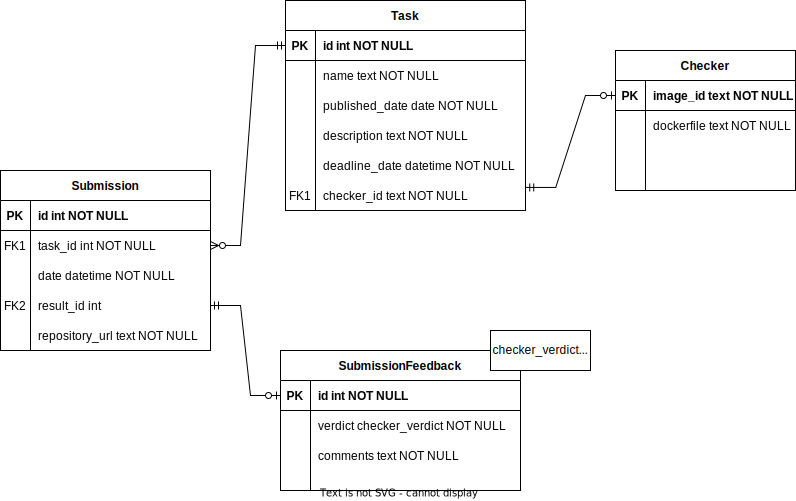
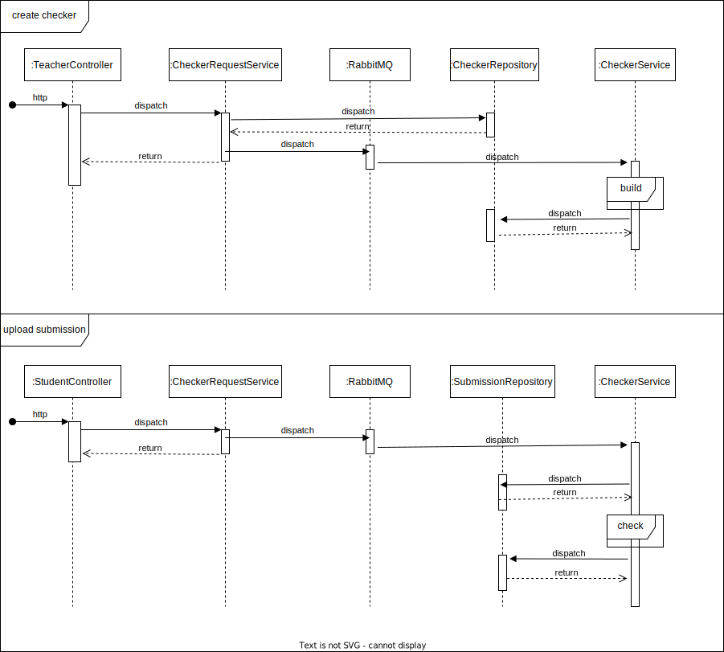

# Описание системы

Система для проверки домашних заданий студентов:

* Cервис поддерживает один курс, на который записан только один студент, поэтому авторизации нет.
* Домашняя работа имеет название, дату публикации, условие и дедлайн.
* Попытка сдачи домашней работы содержит домашнюю работу, к которой относится, дату и время сдачи, и результат проверки,
  состоящий из оценки и комментариев.
* Проверка выполняется полностью автоматически — при поступлении попытки сдачи сервис запускает на решении
  программу-чекер, которая говорит «да» или «нет» и что-то выводит в stdout.
* Преподаватель сам пишет эту программу для каждой домашней работы в виде докерфайла.

Главная страница клиентской части веб-приложения содержит кнопки с переходами на страницы студента и преподавателя.

На странице студента студент может:

* Просматривать список домашних работ, отсортированный по близости дедлайна, причём показываются только работы, дата
  публикации которых уже наступила.
* Сдать решение в виде ссылки на GitHub — для этого ему надо кликнуть на элемент списка домашних работ, в результате
  чего он попадёт на экран с детальной информацией о работе (включая полное условие), полем для ввода ссылки на решение
  и кнопкой «Submit».
* Просмотреть список своих результатов, отсортированный по дате сдачи.
* Просмотреть детальную информацию о попытке по клику на элемент списка результатов, включая текстовый вывод
  программы-чекера.

На странице преподавателя преподаватель может:

* Добавить новую домашнюю работу.
* Просмотреть список результатов, отсортированный по дате сдачи.
* Просмотреть детальную информацию о попытке по клику на элемент списка результатов, включая текстовый вывод
  программы-чекера.

Поскольку проверка может занимать значительное время, ей занимается не непосредственно веб-приложение, а раннер,
работающий как отдельное приложение и связанный с веб-частью с помощью очереди сообщений RabbitMQ. Раннеров может быть
много, очередь балансирует между ними нагрузку.

## Компоненты

- Core. В данном компоненте лежат классы-модели объектов нашей системы и классы-репозитории для работы с моделями и
  базой данных.
- API. Данный компонент содержит логику обработки запросов от пользователей. Классы-контроллеры, слушающие
  REST-Endpoint'ы, и классы-сервисы, которые управляют потоком данных.
- Runner. Компонент, отвечающий за проверку программ. Содержит класс-сервис, который создает докер-образ с чекером
  для задачи и создает контейнеры с решениями.
- RabbitMQ. Брокер обмена сообщениями между компонентами - между API и Runner.

## Общая схема

## Core

### Entites-relationships

- Task. Сущность, содержащая информацию о заданиях. Хранит название, дату публикации, дату крайнего срока сдачи,
  описание и ссылку на идентификатор чекера.
- Submission. Сущность, содержащая информацию о посылках студента. Хранит ссылку на задачу, к которой это решение, дату
  посылки, и впоследствии результат проверки.
- Checker. Сущность, содержащая информацию о чекере. Хранит содержание Dockerfile и идентификатор.

### Repositories

Классы-репозитории описывают то, как мы будем доставать данные из базы данных. Предполагается использовать `jOOQ`.

## API

Для создания и обработки REST-эндпоинтов мы будем использовать Spring.

- submissions
    - `submissions/view`. Просмотреть все. Возвращает список всех попыток.
    - `submissions/{submissionId}`. Просмотреть конкретную. Возвращает детальную информацию о попытке с
      номером `submissionId`.
- tasks
    - `tasks/view`. Просмотреть все. Возвращает список всех заданий.
    - `tasks/{taskId}`. Просмотреть конкретную. Возвращает детальную информацию о задании с номером {taskId}.
- teacher
    - `/teacher/uploadChecker`. Позволяет загрузить чекер преподавателю. Тело: json, представляющий Dockerfile. Этот
      Dockerfile вместе с генерированным название кладется в базу, и создается event на создание нового докер образа.
- student
    - `/student/uploadSubmission`. Позволяет загрузить чекер преподавателю. Тело: json, содержащий ссылку на GitHub.
      Создается новая попытка и кладется в базу, также создается event на проверку решения. `CheckerService` клонирует
      репозиторий, `mount`ит эту папку в новый докер-контейнер и запускает проверялку.
      

## RUNNER

Runner ожидает, что Dockerfile заканчивается строчкой `ENTRYPOINT [Запуск чекера на папке /solution]`.

- Для создания чекера, достаточно положить Dockerfile и запустить `docker build -t {переданное название} .`
- Для проверки решения достаточно сделать `git clone {url} && docker run -v {repo-name}:/solution {чекер}`.
