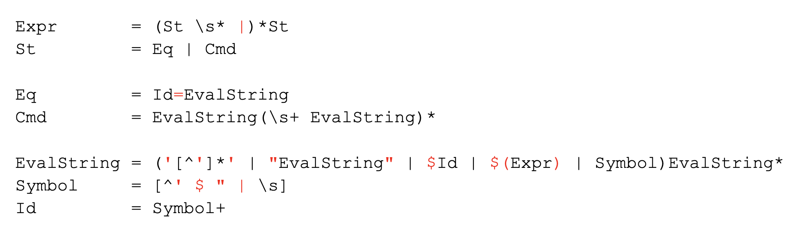

# sd-practice
## Грамматика
На картинке красным выделены символы, имеющее буквальное значение.



При построении грамматики мы постарались учесть семантику баша про одинарные/двойные кавычки, а также использование `$`.

* `Expression` — последовательность выражений через пайп.
* `Statement` — команда либо присваивание.
* `Assignment` — присваивание: название может быть только Id, значение любым вычисляемым.
* `Command` — команда: название и 0+ аргументов.
* `EvalString` — строка без пробелов, в которой учитываются одинарные и двойные кавычки и операции с `$`. Второе можно вычислить, подставив вместо `$x` значение `x` или вычислив значение внутри `$(...)`.
* `Symbol` — любой неспециальный символ.

## Архитектура
На схеме красным выделена вторая фаза.
### Описание
#### Main
`Main` в цикле обрабатывает команды: подает строки парсеру, который парсит согласно грамматике выше, получая `Expression` в случае успеха.

Также в начале создается экземпляр `Environment`, который является оберткой над `Map<String, String>`. Это окружение нашей программы. Стоит отметить, что башевские переменные независимы от наших, и что наши переменные живут только во время исполнения программы.

#### Expression Handler
`Expression` передается в хендлер, который в случае без пайпов состоит из всего одного `Statement`. Во второй фазе с пайпами он может состоять из нескольких выражений, и тогда вызывает их последовательно, передавая получившийся `OutputStream` из `i`-ого `Statement` в `(i+1)`-ый `InputStream`. Для каждого `Statement` вызывается `handle` у `Statement Handler`-а.

#### Statement Handler
Для второй фазы: она сначала вычисляет все `EvalString` внутри `Statement`, используя `Env` и формальное описание грамматики:
* `sub('string') = string`
* `sub("evalStr") = sub(evalStr)`
* `sub($id) = env.get(id)`
* `sub($(expression)) = ExpressionHandler.execute(expression)`
* `sub(symbol) = symbol`

Вычислив все `EvalString`, внутри `Statement` не остается вычислений с помощью `$`.

После этого `handle` в зависимости от типа `Statement`(напомним, он может быть либо `Assignment`, либо `Command`) вызывает `executeAssignment`, который просто изменяет состояние, или `executeCommand`, который делегирует вызов абстрактной команде.

#### AbstractCommand
В этом классе происходит распознавание и исполнение команды. Интерфейс команды - список аргументов(строк) и `InputStream` с предыдущей команды в пайплайне.

В хранящуюся мапу любой наследник класса должен дописать строчку вида
```
map["exit"] = ExitCommand()
```
Таким образом, распознавание команды выглядит как `map[args.first()]`.

В методe `call` происходит распознавание: если такой команды нет, то вызывается внешняя. Метод `perform` является абстрактным, его должны переопределить наследники. Наследниками данного класса являются классы-команды `CatCommand`, `EchoCommand`, `WcCommand`, `PwdCommand`, `ExitCommand`.

Самой интересной командой нам показался `exit`. У нас была жаркая дискуссия в ходе которой, так и не было выявлено решение устраивающее нас всех. 
- Бросить исключение и поймать его в ExpressionHandler
  - Минусы: не круто, что какая-то логика работы завязана на исключеняих (не обработка ошибок)
- Не исключение
  - Либо выдавать `bool, OutputStream` где `bool` это флаг, говорящий о том, что был ли `exit`
  - Либо у команды сделать флаг `isFinal`
  - Минусы: придется писать много (может и не много) ифов и не хочется заводить флаги ради одной команды `exit`

#### Остальное
Комментарий про многопоточность: в пайплайне можно выделить независимые части, который можно выполнять параллельно. Это требует анализа выполнения самой команды:  на первый взгляд важно читает ли она вообще из предыдущей и является ли она `exit`. Также необходимо решить, что делать с присваиванием: логичным тут кажется вариант, что то и только то, что следует после операции присваивания, видит результат этого самого присваивания. В таком варианте нужно сначала пройтись по всем выражением в линейном порядке, учитывая присваивания и вычисляя все `$`, после чего уже выполнять сами команды с начала с возможным параллелизмом.


